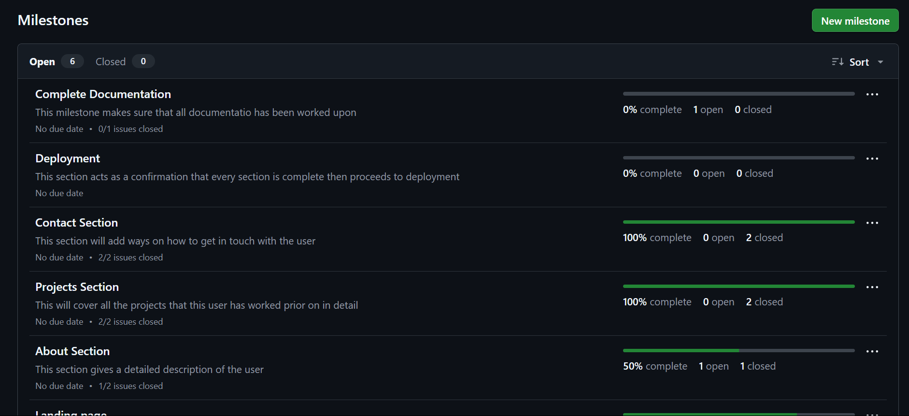
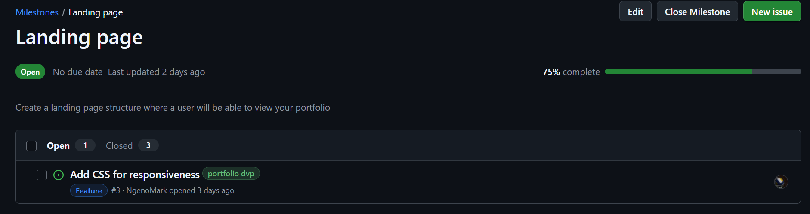
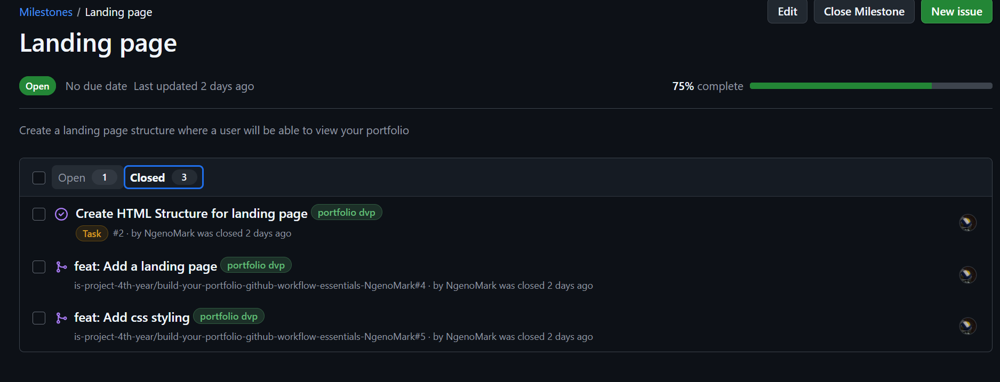
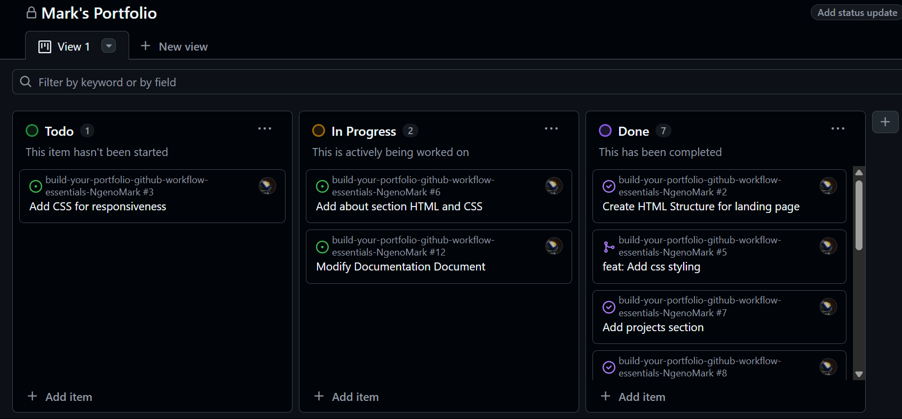
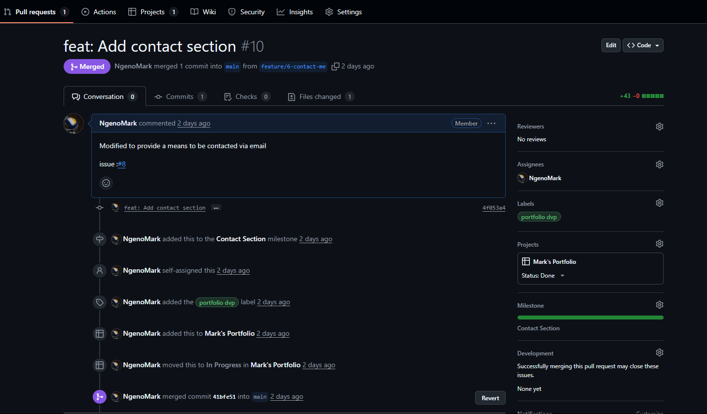
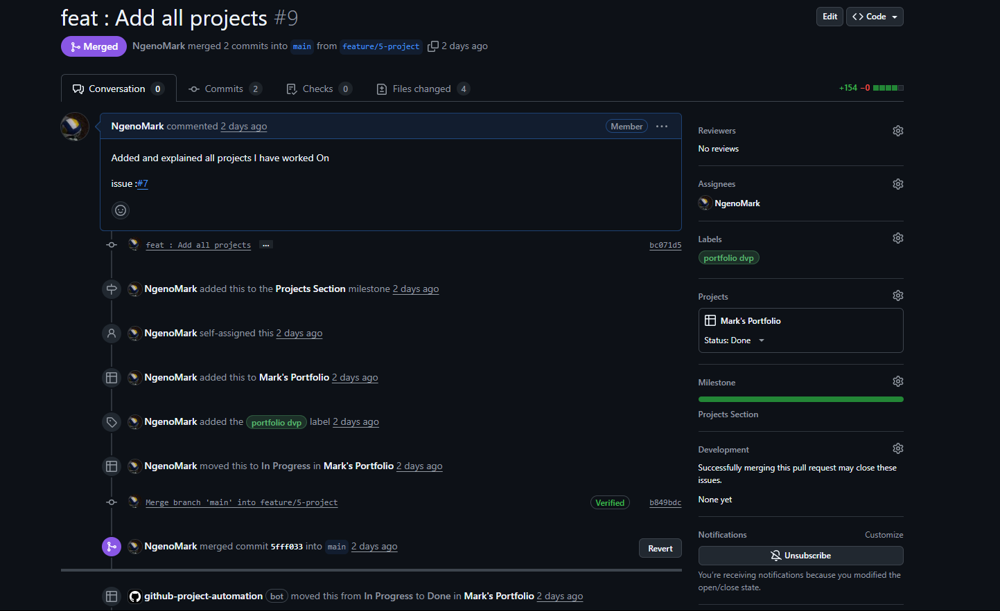
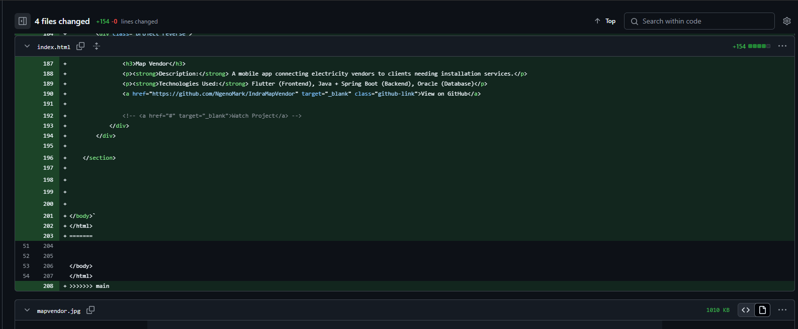

# Personal Portfolio Documentation

## 1. Student Details

- **Ngeno Mark Kipchumba**:
- **151430**:
- **GitHub Username : NgenoMark**:
- **kipchumbamark48@gmail.com**:

## 2. Deployed Portfolio Link

- **GitHub Pages URL**:  
  _(Provide the live link to your deployed portfolio website)_

## 3. Learnings from the Git Crash Program

Write about **4 things** you expected to learn during the Git crash course (yes, we all came in with some big hopes 😅).
For each one, mention:

**1**
Based on the tutorials we had done in class i thought everything would be easy.

What you thought it would be like **(Expectation 👀)**

What you actually learned **(Reality 😅)**

And how it helped with your personal portfolio project 💻

make it honest—and if it surprised you, even better!

Example format:

**🧠 What I Thought I'd Learn vs What I Actually Learned**
**1. Concept: Branching**

`Expectation 👀` : I thought branching was just for developers working on big apps—nothing I’d need for a small project.

`Reality 😅`: Turns out even solo devs need branches! It helped me avoid breaking my main code while testing new designs.

`Impact 💡`: I created a feature branch for my "About Me" section and merged it smoothly into the main branch after testing. Super useful!

## 4. Screenshots of Key GitHub Features

### A. Milestones and Issues

The above image shows all the milestones that define this project from start to end. Some of the major milestones as can be seen are Landing Page, About Section, Contact Section.

The above images show the opened and closed issues under the landing page milestone that was worked upon, we are able to track progress by completion percantage.

### B. Project Board

The above image shows my Project Board(Mark's Portfolio).
It classifies all issues into ToDo, In Progress and Done.
I ccan clearly track what to do and how to keep oneself accountable from the project board.

### C. Branching

- Screenshot showing your branch list with meaningful naming.

### D. Pull Requests

The image above displays a pull request linked specifically to the contact section, this was the last section being worked on and immediately after completion a pull request was created to keep the main branch up to date. 

### E. Merge Conflict Resolution

The above image shows a merge conflict expereience while working on issue to add the project section.
Several lines had overlapped and we had an issue in trying to resolve in github because the feature to show the conflicts was not present and thus it took a lot of time to understand what had overlapped.
