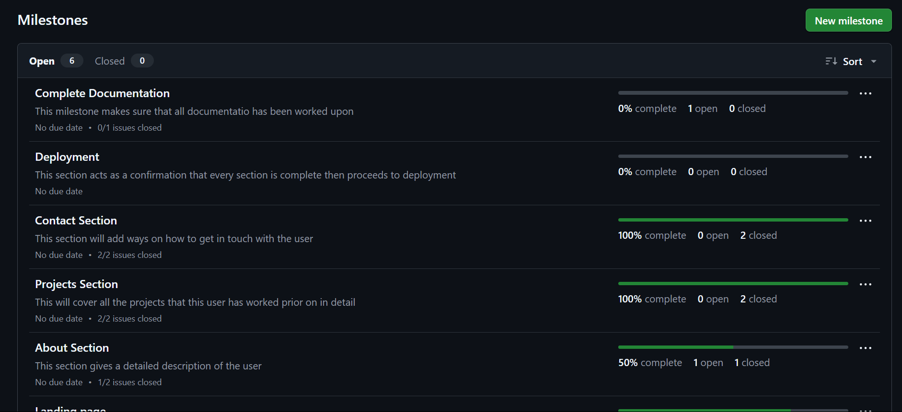
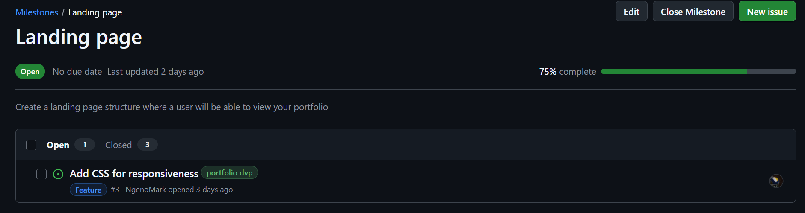
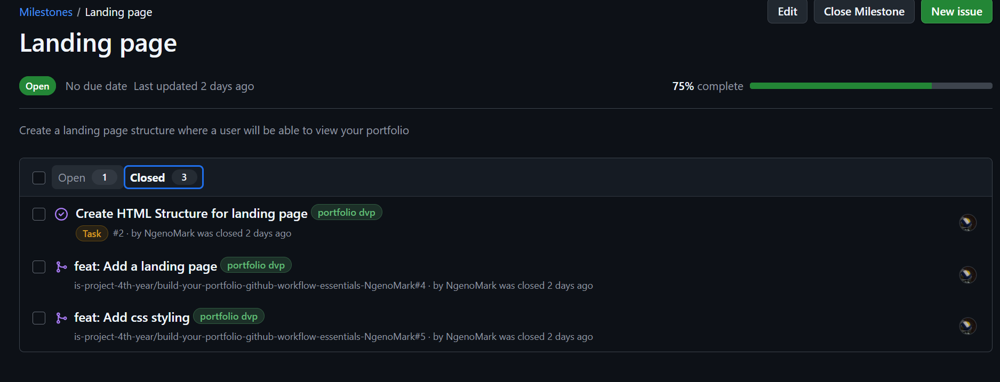
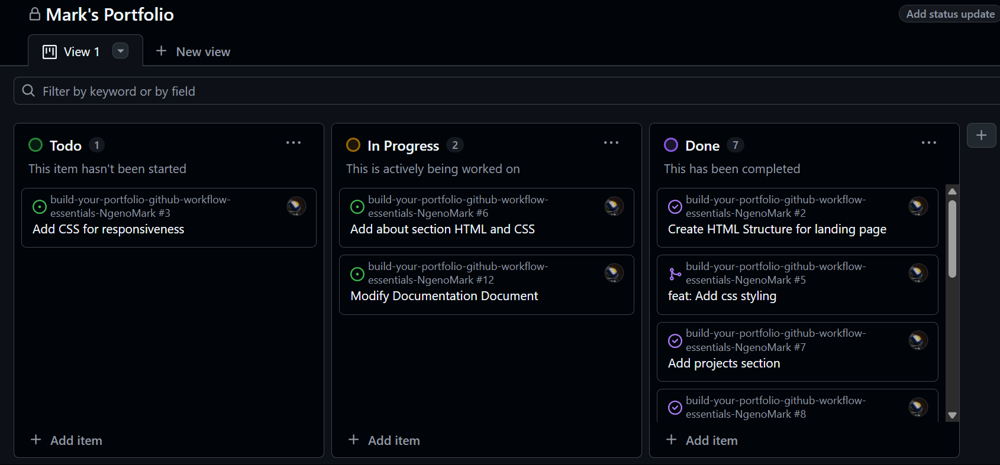
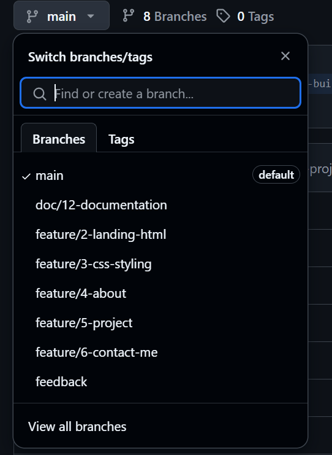
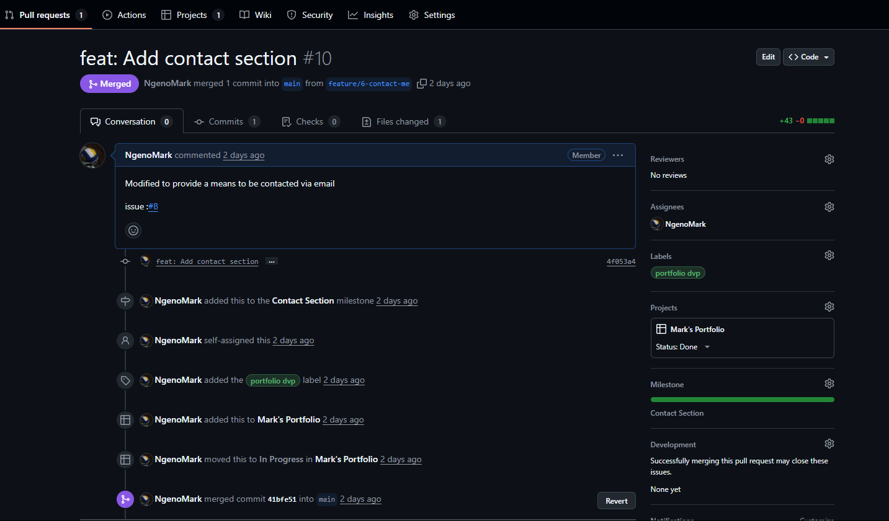
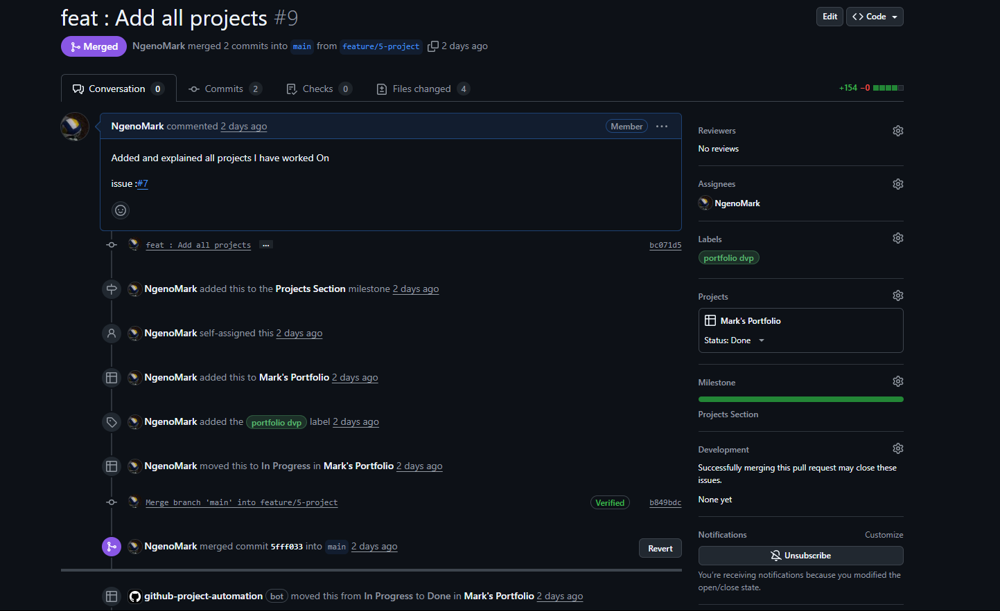
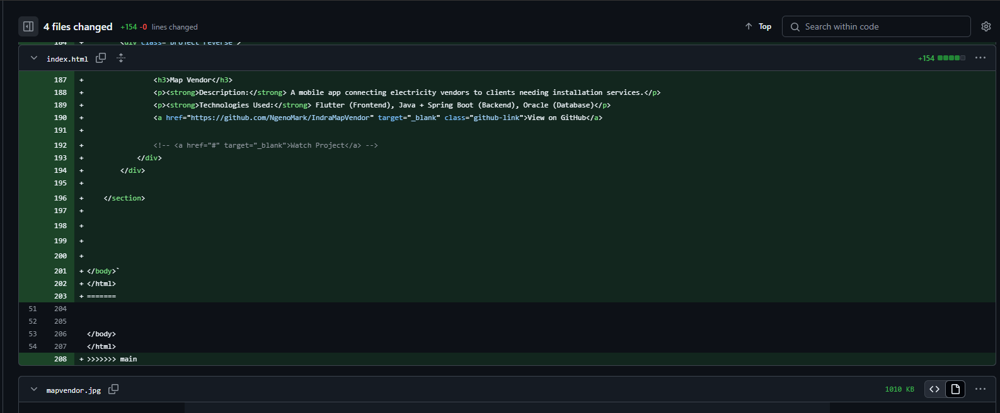

# Personal Portfolio Documentation

## 1. Student Details

- **Student Name**: Ngeno Mark Kipchumba
- **Admission**: 151430
- **GitHub Username** : NgenoMark
- **Email** : kipchumbamark48@gmail.com
- **School Email** : mark.nge-@strathmore.edu

## 2. Deployed Portfolio Link

- **GitHub Pages URL**:  
  
  https://is-project-4th-year.github.io/build-your-portfolio-github-workflow-essentials-NgenoMark/

## 3. Learnings from the Git Crash Program

Write about **4 things** you expected to learn during the Git crash course (yes, we all came in with some big hopes 😅).
For each one, mention:
1. **Concept: Naming Convention**
Expectation: Based on all projects i had worked on, standard names were used to trak and work on progress such as master, progress etc

Reality: When working in both group settings and personal project, it is a good practice to use named branches to understand the purpose of each branch. I had to create a total of 7 branches which all could do the same thing but this created better order and purpose.

Impact: Now depending on the project I understand why i would need specific branches to work on specific sections of my work.

2. **Concept: GitHub Issues & Project Board**

Expectation: I assumed the project board was optional or just for tracking big commercial apps and that i would just create it and never interact with it.

Reality: The board helped me stay organized. Each issue and milestone was easier to manage when I saw it under “To Do”, “In Progress”, or “Done”. This made things also cleaner.

Impact: It made the entire process feel easy and helped me complete work in steps instead of working randomly.

3. **Concept: Pull Requests & Merge Conflicts**

Expectation: I thought pull requests were only needed for team collaborations and that conflicts were rare.

Reality: Conflicts happen easily—even when I’m working alone. Using pull requests helped me track and control changes, and resolving a conflict taught me how to be careful with overlapping edits. Sometimes being careful did not matter i still ended up witht a conflict that took me an hour to resolve simply because I did not  understand what conflict i was working on.

Impact: I simulated and resolved a merge conflict between two branches that edited the same line in index.html. I now understand the importance of order and undertanding of documentation.

4. **Concept: Deployment via GitHub Pages**

Expectation: I thought deployment was something that required Firebase setup or even buying a domain since that is what we are used to doing.

Reality: GitHub Pages made it simple to publish my portfolio by just pushing to the main branch. No extra things needed.

Impact: My site is now live and I can share it with others as a sample of my work.

## 4. Screenshots of Key GitHub Features

### A. Milestones and Issues

The above image shows all the milestones that define this project from start to end. Some of the major milestones as can be seen are Landing Page, About Section, Contact Section.

The above images show the opened and closed issues under the landing page milestone that was worked upon, we are able to track progress by completion percantage.

### B. Project Board

The above image shows my Project Board(Mark's Portfolio).
It classifies all issues into ToDo, In Progress and Done.
I ccan clearly track what to do and how to keep oneself accountable from the project board.

### C. Branching

The above screenshot shows all the branches present during the working of this project:
They were named by type of work and a number
example 
1. feature/2-landing page - A feature we added on our portfolio was the landing page structure and this was issue number 2 and thus one can easily interpret the name
2. doc/12-documentation - This was a branch specifically to edit document files such as the documentatin.md

### D. Pull Requests

The image above displays a pull request linked specifically to the contact section, this was the last section being worked on and immediately after completion a pull request was created to keep the main branch up to date. 

### E. Merge Conflict Resolution

The above image shows a merge conflict expereience while working on issue to add the project section.
Several lines had overlapped and we had an issue in trying to resolve in github because the feature to show the conflicts was not present and thus it took a lot of time to understand what had overlapped.
